Language : 🇺🇸 | [🇨🇳](./README.zh-CN.md)

<p align="center">
  <a href="https://nestjs.com">
    <picture>
      <source media="(prefers-color-scheme: dark)" srcset="https://nestjs.com/logo-small-gradient.76616405.svg">
      
    </picture>
    <h1 align="center">Nest-Admin</h1>
  </a>
</p>

<div align="center">

A out of the box backend management system based on the latest version of Nestjs


</div>

- Preview: http://linlingqin.top:3000/admin
- Domestic Mirror: https://gitee.com/linlingqin/Nest-Ruoyi-Admin
- github:https://github.com/linlingqin77/Nest-Ruoyi-Admin.git

## Built in features

1. User management: Users are system operators, and this function mainly completes system user configuration.
   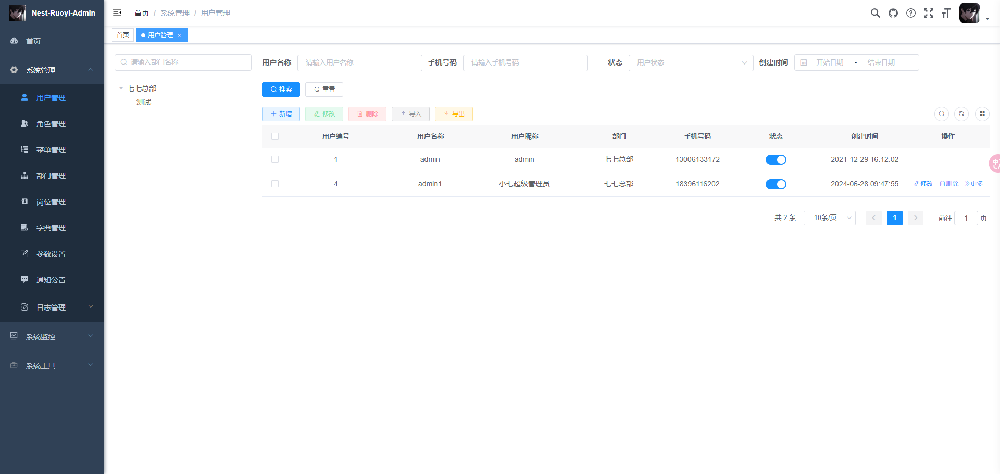
2. Department management: Configure the system's organizational structure (company, department, group), and display a tree structure that supports data permissions.
   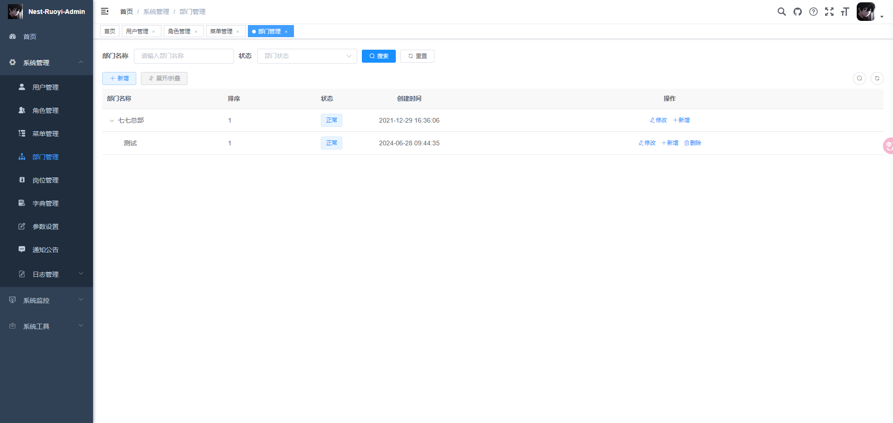
3. Job management: Configure the positions that system users belong to.
   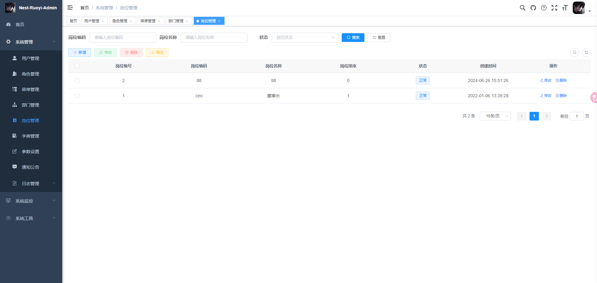
4. Menu management: Configure system menus, operation permissions, button permission identification, etc.
   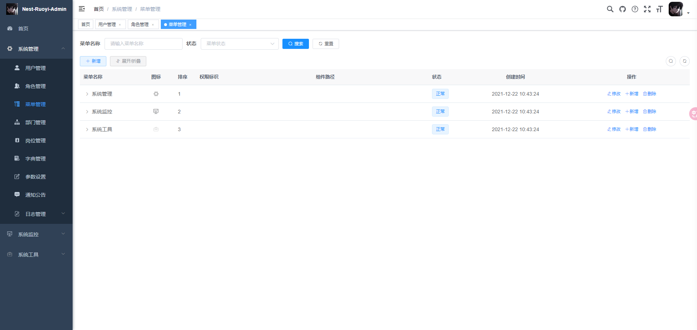
5. Role management: Assign role menu permissions and set roles to divide data scope permissions by organization.
   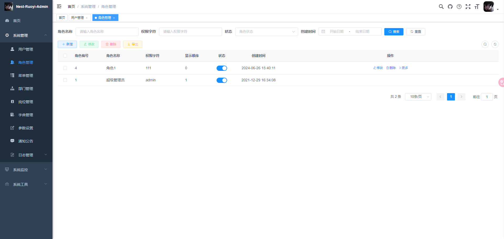
6. Dictionary management: Maintaining fixed data that is frequently used in the system.
   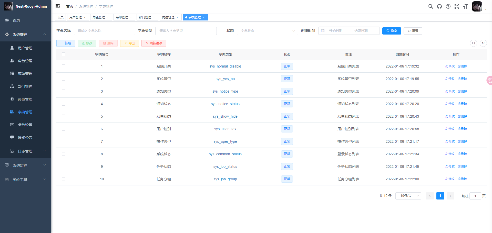
7. Parameter management: Dynamically configure commonly used parameters for the system.
   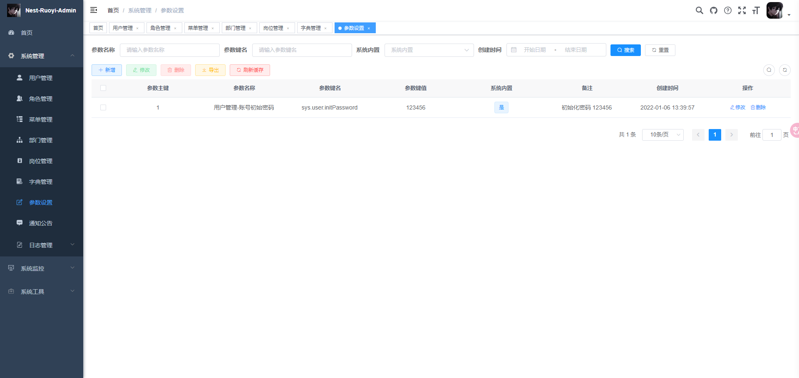
8. Notification announcement: System notification announcement information release and maintenance.
   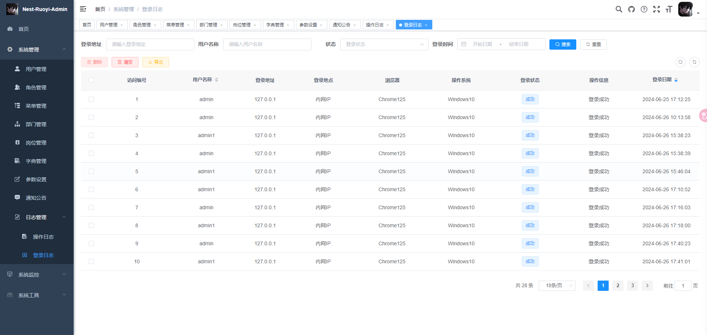
9. Operation log: Record and query normal system operation logs; Logging and querying of system exception information.
   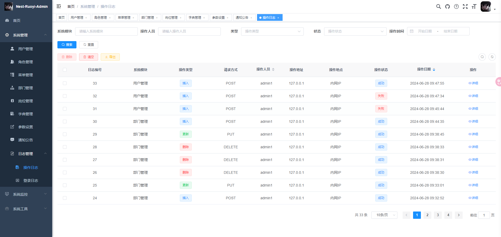
10. Login log: The system login log records and queries contain login exceptions.
    
11. Online users: monitoring the status of active users in the current system.
    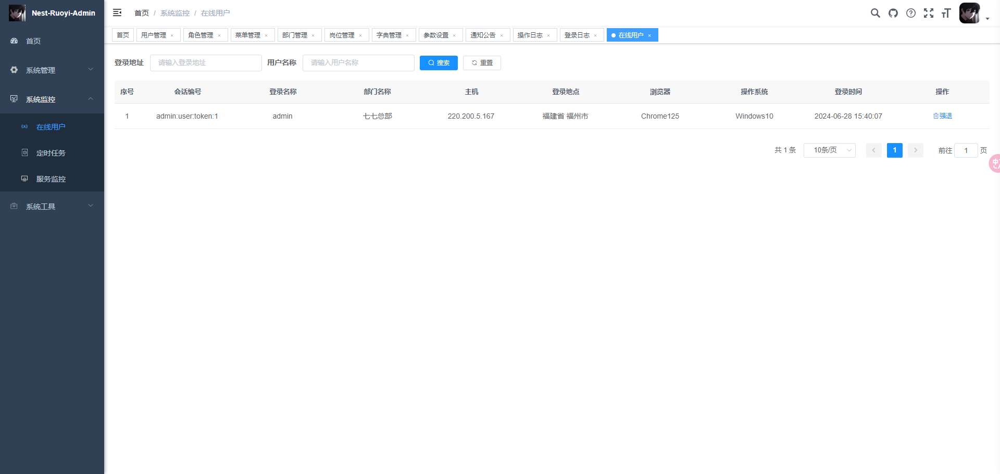
12. Timed tasks: Online (add, modify, delete) task scheduling includes execution result logs.
    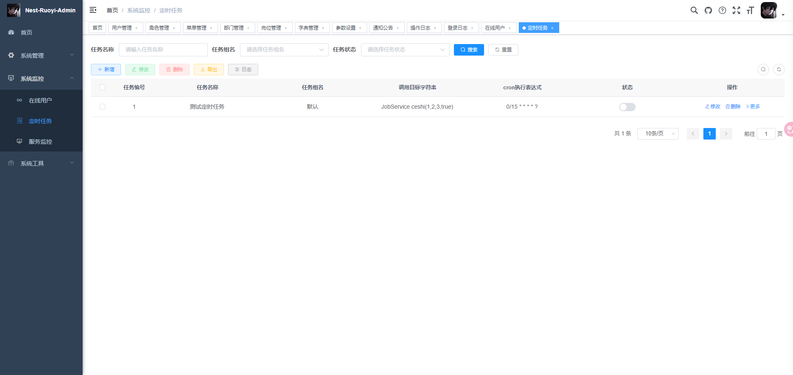
13. Code generation: The generation of front-end and back-end code (node, HTML, SQL) supports CRUD downloading.
14. System Interface: Automatically generate relevant API interface documents based on business code.
15. Service monitoring: Monitor current system CPU, memory, disk, stack, and other related information.
    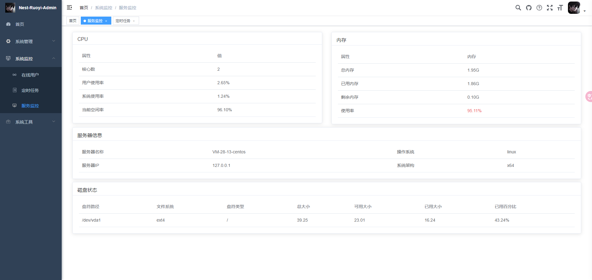
16. Cache monitoring: Queries, deletes, clears, and other operations on the system's cache.
17. Online Builder: Drag form elements to generate corresponding HTML code.
    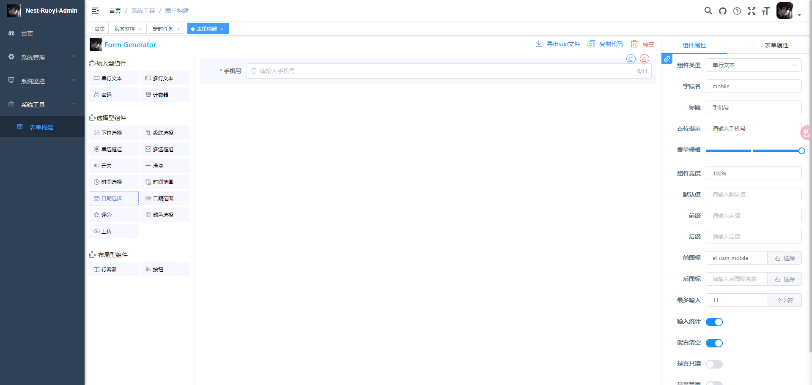
18. Connection Pool Monitoring: Monitor the current status of the system database connection pool and analyze
    SQL to identify system performance bottlenecks.

## Usage

### Install

```shell
$ git clone https://github.com/linlingqin77/Nest-Ruoyi-Admin.git
```

Install dependencies:

```shell
$ cd Nest-Ruoyi-Admin && yarn insatll
```

run：

```shell
$ npm run start:dev
```

## Browsers support

Modern browsers.

| [](http://godban.github.io/browsers-support-badges/)</br>Edge | [](http://godban.github.io/browsers-support-badges/)</br>Firefox | [](http://godban.github.io/browsers-support-badges/)</br>Chrome | [](http://godban.github.io/browsers-support-badges/)</br>Safari | [](http://godban.github.io/browsers-support-badges/)</br>Opera |
| ----------------------------------------------------------------------------------------------------------------------------------------------------------------------------------------------------- | ----------------------------------------------------------------------------------------------------------------------------------------------------------------------------------------------------------------- | ------------------------------------------------------------------------------------------------------------------------------------------------------------------------------------------------------------- | ------------------------------------------------------------------------------------------------------------------------------------------------------------------------------------------------------------- | --------------------------------------------------------------------------------------------------------------------------------------------------------------------------------------------------------- |
| Edge                                                                                                                                                                                                  | last 2 versions                                                                                                                                                                                                   | last 2 versions                                                                                                                                                                                               | last 2 versions                                                                                                                                                                                               | last 2 versions                                                                                                                                                                                           |

## Contributing

Any type of contribution is welcome, here are some examples of how you may contribute to this project:

- Use Ant Design Pro in your daily work.
- Submit [issues](https://github.com/linlingqin77/Nest-Ruoyi-Admin/issues) to report bugs or ask questions.
- Propose [pull requests](https://github.com/linlingqin77/Nest-Ruoyi-Admin/pulls) to improve our code.

## Concat

wechat: `llq1359533212`
qq：`1359533212`
